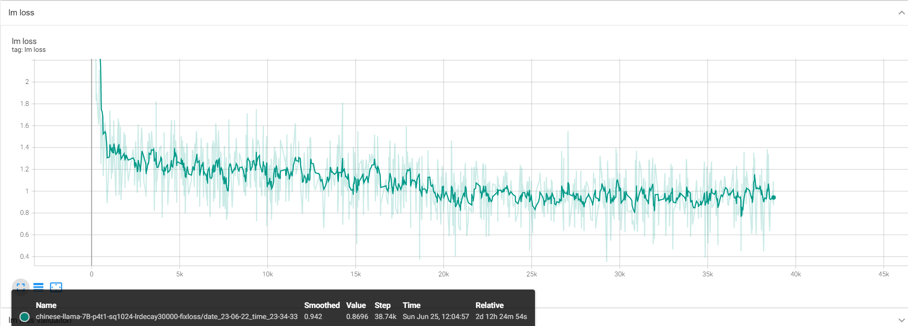

# Megatron-LLaMA

## 权重导入

目前支持LLaMA官方开源权重和HuggingFace权重的导入。我们导入外部权重的思路是先根据原始权重模拟生成一个按照Megatron-LM方式存储的权重，然后再让Megatron-LM读入，这样就不需要对Megatron-LM的代码进行修改。

### LLaMA官方pth权重

llama官方权重使用 ``./tools/llama/checkpoint_convert_from_llama_pth.py`` 进行转化。
该脚本中执行时：
1. 读入llama的权重
2. 将llama的权重修改为megatron-lm的形式，包括调整attention qkv-proj的权重存储方式和调整字典关键字等
3. 根据模型并行参数切分权重并存储

Megatron-LM 在存储权重时会根据模型并行的方式将完整的模型权重切分为每个模型并行块上独立的权重，因此在使用时需要指定训练时的张量并行维度 ``--tensor_size`` 和流水线并行维度  ``--pipeline_size`` 。如在一个含有8张GPU的机器上使用 ``TP=2,DP=2,PP=2`` 的并行策略，则对应权重转化脚本如``./prepare_original_llama_weight.sh``：

```shell
python ./tools/llama/checkpoint_convert_from_llama_pth.py \
    --input_dir ./checkpoints/checkpoint-llama \
    --model_size 7B \
    --output_dir ./checkpoints/llama-7B-p2t2 \
    --pipeline_size 2 \
    --tensor_size 2
```

### HuggingFace权重

huggingface存储格式与pth略有区别，我们先将huggingface的权重转化为pth格式，再使用与llama官方权重相同的方式将其转为megatron-lm格式。我们使用 ``./tools/llama/convert_llama_pth_from_hf.py`` 实现huggingface到pth格式的转化。 ``./prepare_chinese_llama_weight.sh`` 是一个完整的例子

```shell
# generate torch pth for chinese llama

python ./tools/llama/convert_llama_pth_from_hf.py \
    --base_model ./checkpoints/ymcui-chinese-llama-alpaca-plus-7B \
    --output_type pth \
    --output_dir ./checkpoints/chinese-llama/7B

python ./tools/llama/checkpoint_convert_from_llama_pth.py \
    --input_dir ./checkpoints/chinese-llama \
    --output_dir ./checkpoints/chinese-llama-7B-p1t4 \
    --model_size 7B \
    --pipeline_size 1 \
    --tensor_size 4
```

### 正确性验证

在arxiv数据集上进行了简单的测试，并逐层打印对比了Megatron-LM与llama官方仓库的输出，结果基本一致（由于混精和使用融合算子等问题，Megatron-LM和fairscale在小数点后3位以后可能存在差异，不过不影响整体结果）
lm-loss大致在2~3，基本符合预期的loss水平。


## SFT

使用 ``llama_sft.sh`` 进行llama的有监督微调。

``llama_sft.sh`` 中的主要参数说明如下：

* MODEL_ARGS : 用于匹配不同规格的LLAMA，其中 seq-length 和 max-position-embeddings 在SFT时可以比LLAMA预训练时更小，但在数码数据集上目前最低支持到1024

* LLAMA_ARGS ：用于在Megatron-LM中对齐llama的模型结构，不可修改

* TRAIN_ARGS : 主要是训练时学习率和batch size的设置，finetune时暂时不支持梯度累加，因此 ``global-batch-size = micro-batch-size * data-parallel-size``

* TOKENIZER_MODEL：使用的tokenizer路径，注意使用不同权重时要加载对应的tokenizer，尤其是使用中文llama时要换用中文的tokenizer（./checkpoints/chinese-llama/7B/tokenizer.model）

目前已经在数码数据集上进行了一轮训练，loss曲线如下：



最终训练loss约为0.91 测试loss约为0.89
